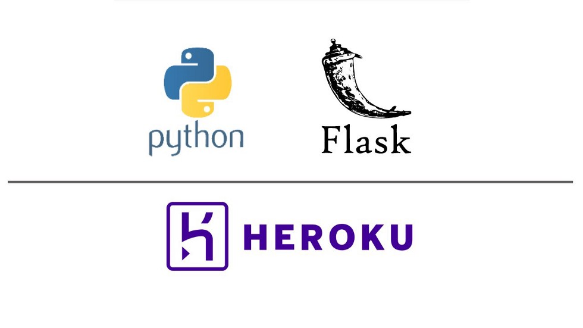
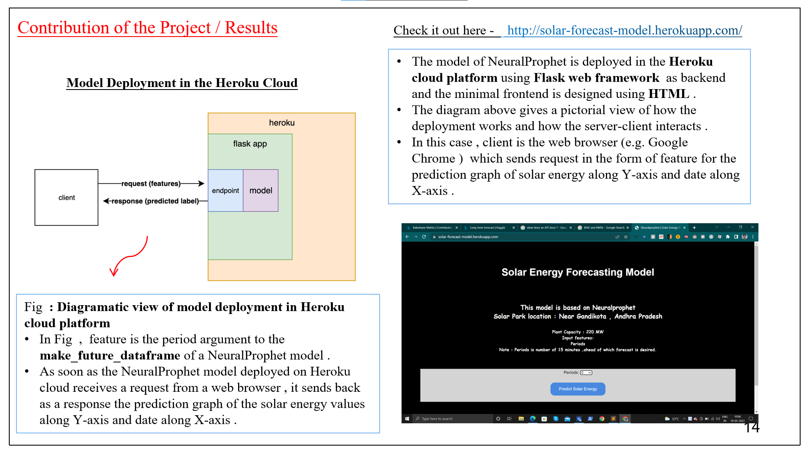
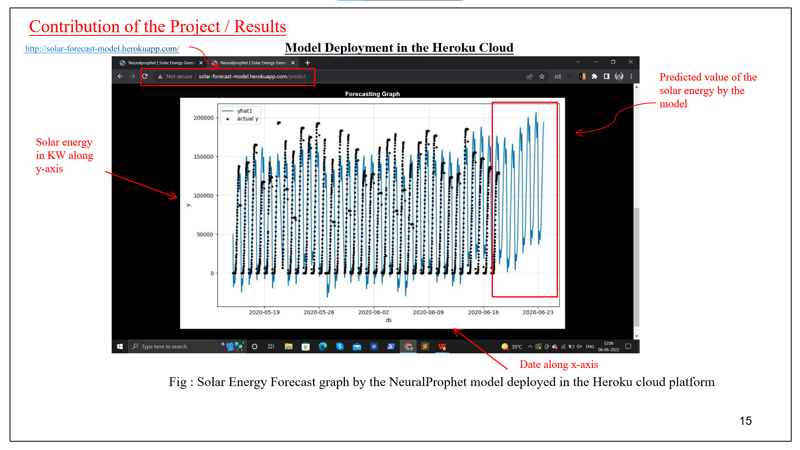
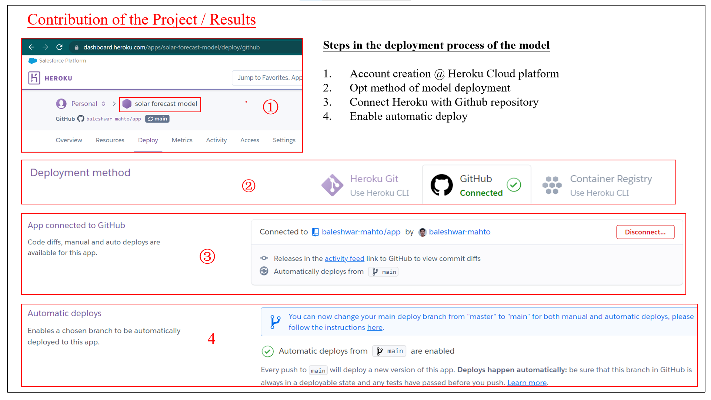

# A flask webapp deployed using Heroku cloud platform

- Find the deployed flask webapp here @ http://solar-forecast-model.herokuapp.com/
---
- Directory structure of the Flask project - 

                                               app
                                    /        /      \       \
                                templates  app.py  Procfile  requirements.txt
                                 /
                            index.html
                            
---

